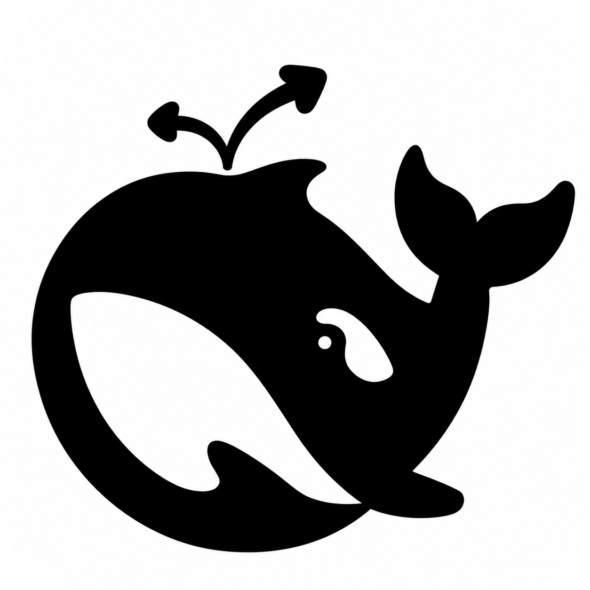
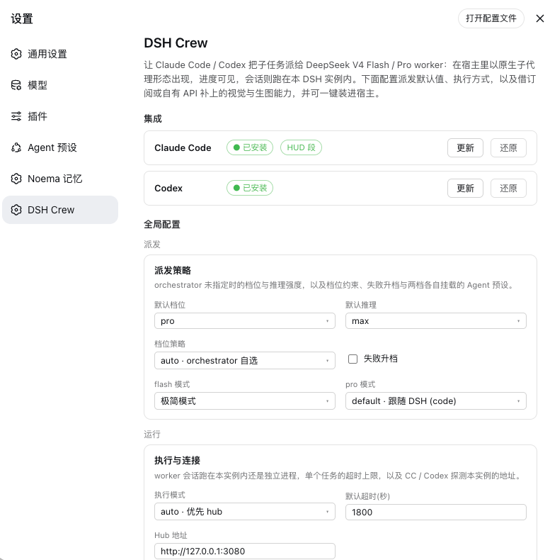

<p align="center">
  
</p>

<h1 align="center">DSH Crew</h1>

<p align="center">
  <strong>Ein <a href="https://github.com/deepseek-ai/deepseek-harness">DeepSeek Harness</a>-Plugin: Arbeiten an DSH-Agents von Claude Code / Codex aus verteilen, ohne auf die native Subagent-UI des Hosts zu verzichten.</strong><br />
  <sub>Native Fortschritts-UI &bull; Tier-Richtlinie &amp; Eskalation &bull; DSH-Sitzungen im Host &bull; Vision &amp; Bildgenerierung &bull; Ein-Klick-Installation</sub>
</p>

<p align="center">
  <sub>npm: <code>@zseven-w/dsh-crew</code> &middot; Aktuelle Plugin-Version: <code>0.1.0</code> &middot; Getestet mit DSH <code>0.1.0-rc.6</code></sub>
</p>

<p align="center">
  <a href="./README.md">English</a> &middot; <a href="./README.zh.md">简体中文</a> &middot; <a href="./README.zh-TW.md">繁體中文</a> &middot; <a href="./README.ja.md">日本語</a> &middot; <a href="./README.ko.md">한국어</a> &middot; <a href="./README.fr.md">Français</a> &middot; <a href="./README.es.md">Español</a> &middot; <a href="./README.de.md"><b>Deutsch</b></a> &middot; <a href="./README.pt.md">Português</a> &middot; <a href="./README.ru.md">Русский</a> &middot; <a href="./README.hi.md">हिन्दी</a> &middot; <a href="./README.tr.md">Türkçe</a> &middot; <a href="./README.th.md">ไทย</a> &middot; <a href="./README.vi.md">Tiếng Việt</a> &middot; <a href="./README.id.md">Bahasa Indonesia</a>
</p>

<p align="center">
  <a href="https://github.com/ZSeven-W/dsh-crew/blob/main/LICENSE"></a>
</p>

<br />

<p align="center">
  
</p>
<p align="center"><sub>Die DSH-Crew-Einstellungsseite — Host-Integrationen, Dispatch-Richtlinie, Ausführung und die multimodale Brücke</sub></p>

## Warum DSH Crew

DSH Crew ist ein Plugin für [DeepSeek Harness](https://github.com/deepseek-ai/deepseek-harness) (DSH) — eine Open-Source-Agent-Harness. Es macht DSH-Agents von Claude Code und Codex aus einsetzbar: Der Orchestrator behält sein eigenes Modell, die Arbeit läuft auf einem echten DSH-Agent mit den Tools, der Sandbox, den Presets und dem Sitzungsverlauf dieser Harness, und der Host zeigt sie weiterhin als nativen Subagent mit Live-Fortschritt an.

Was die Arbeit ausführt, ist ein DSH-Agent, kein bloßer Modellaufruf. Tiers (`flash` / `pro`) bestimmen, wie viel Leistungsfähigkeit dieser Agent aus der konfigurierten Modell-Roster der Harness erhält — heute DeepSeek V4 Flash und V4 Pro —, sodass eine Modelländerung in DSH hier keine Änderung erfordert.

<table>
<tr>
<td width="50%">

### 🧵 Native Fortschritts-UI

Workers erscheinen als normale Subagents in Claude Code / Codex — Dispatch-Anzahl, laufender Schritt, Tool-Aufrufe und Token-Verbrauch werden im eigenen Aufgabenbereich des Hosts angezeigt, plus ein claude-hud-Statuszeilen-Segment: `⚙dsh 1▶pro 2m14s 21.7k/606 ✓3`.

</td>
<td width="50%">

### 🎚️ Tier-Richtlinie und Eskalation

`flash` für mechanische Arbeit, `pro` für Reasoning, `effort` von `off` bis `max`. `tier_policy` kann jeden Dispatch auf der Tool-Ebene auf einen einzigen Tier begrenzen, und `escalate_on_failure` wiederholt einen fehlgeschlagenen Flash-Lauf einmal auf pro — basierend auf Belegen, nicht auf einer vorab geratenen Schwierigkeit.

</td>
</tr>
<tr>
<td width="50%">

### 🏛️ DSH-Sitzungen im Host

Mit dem in einem DSH-Profil installierten Bundle ist jeder Worker eine DSH-Sitzung erster Klasse: sichtbar in der Web-UI, nach Arbeitsverzeichnis gruppiert und mit dem Agent-Preset gemountet, das Sie pro Tier wählen. Wenn DSH nicht läuft, fällt der Dispatch auf eine eigenständige DSH-Runtime zurück, sodass CI- und Headless-Umgebungen weiterhin funktionieren.

</td>
<td width="50%">

### 👁️ Vision und Bildgenerierung

Die Modelle von DSH sind reine Textmodelle. `describe_image` und `generate_image` leihen sich die Augen und den Pinsel der CLIs, die Sie bereits haben — Claude, Codex, Grok, Antigravity — oder einer beliebigen OpenAI-kompatiblen API, die Sie konfigurieren. Eingefügte Bilder bleiben im Gespräch sichtbar und erreichen das Modell als Text.

</td>
</tr>
<tr>
<td width="50%">

### 🔌 Benutzerdefinierte Anbieter

Bringen Sie Ihren eigenen Endpoint mit (Base-URL + API-Schlüssel + Modelle) oder eine lokale Befehlsvorlage. Jeder Anbieter hat einen Konnektivitätstest, der Erreichbarkeit und Authentifizierung prüft und dann einen echten Vision-Aufruf ausführt, damit Sie es jetzt statt mitten in der Aufgabe erfahren.

</td>
<td width="50%">

### 📦 Ein-Klick-Installation

Die Einstellungsseite installiert und aktualisiert für Sie das Claude-Code-Plugin und die Codex-Rollendateien — Marketplace-Registrierung, Berechtigungs-Allowlist, HUD-Verdrahtung, für diesen Rechner gerenderte absolute Pfade — und stellt sie ebenso einfach wieder her. Jede Einstellungsdatei wird zuerst gesichert.

</td>
</tr>
</table>

## So funktioniert es

```
Claude Code / Codex (orchestrator, keeps its own model)
  └─ ds-flash / ds-pro  ← native subagent shell (progress shows in the host's task UI)
       └─ MCP: dsh_run_worker(tier, effort, cwd)
            ├─ hub reachable → session inside DSH (visible in the Web UI, grouped by cwd)
            └─ otherwise     → dsh-jsonrpc-agent runtime (worker.cordis.yml)
                 └─ DeepSeek V4 Flash / Pro (DSH SDK, event stream → progress and token stats)
```

## Vorbereitung

### 1. Abhängigkeiten installieren

```bash
pnpm install
```

Wenn sandbox/pty Probleme mit nativen Modulen meldet, führen Sie einmal aus:

```bash
pnpm approve-builds
```

### 2. DeepSeek-API-Anmeldedaten konfigurieren

Erstellen Sie das Konfigurationsverzeichnis:

```bash
mkdir -p ~/.config/dsh-crew
```

Holen Sie den API-Schlüssel von [platform.deepseek.com](https://platform.deepseek.com), erstellen Sie `~/.config/dsh-crew/.env` und schreiben Sie:

```
DEEPSEEK_API_KEY=sk-...
```

(Die Worker-Runtime verwendet ein eigenes Anmeldedatensystem, unabhängig von Web-DSH; dieser Schlüssel wird nur aus `.env` gelesen und niemals woandershin geschrieben)

### 3. Konfiguration überprüfen

```bash
node scripts/smoke.mjs
```

Innerhalb von etwa 10 Sekunden sollten Sie `smoke test passed — configuration OK` sehen, was eine erfolgreiche Einrichtung anzeigt. Bei einem Fehler werden spezifische Gründe ausgegeben; häufige Probleme sind ein fehlender oder ungültiger API-Schlüssel.

## Hintergrund und Begriffe

- **DSH** (DeepSeek Harness): DeepSeeks Open-Source-Agent-Harness, ein Code-Agent in Web-UI-Form, ähnlich wie Claude Code, aber mit DeepSeek-Modellen.
- **MCP** (Model Context Protocol): Das KI-Tool-Integrationsprotokoll von Anthropic, das LLMs ermöglicht, sicher externe Tools und Datenquellen aufzurufen.
- **Cordis-Bundle**: DSHs Plugin-Format; dieses Projekt kann eigenständig als MCP-Dienst laufen oder im Hub-Modus in DSH Web installiert werden.
- **Tier**: Leistungsstufe — welchen Platz aus DSHs konfigurierter Modell-Roster ein Worker erhält. `flash` ist schnell und günstig (einfache Aufgaben), `pro` denkt härter nach (komplexe Probleme). Heute entsprechen sie DeepSeek V4 Flash und V4 Pro; Modelle in DSH austauschen, und hier ändert sich nichts.
- **Worker**: der DSH-Agent, der die Arbeit erledigt — eine vollständige Sitzung mit eigenen Tools, Sandbox und Preset, kein bloßer Modellaufruf.
- **Effort**: Reasoning-Stärke, `off` = kein Reasoning, `high` = hoher Reasoning-Aufwand, `max` = maximaler Reasoning-Aufwand.

## Claude Code

### Installation

Ein-Klick-Installation (eine Option wählen):

- **DSH-Einstellungsseite** (wenn der Hub-Modus installiert ist): Einstellungen → DSH Crew → „Install to Claude Code"
- **Befehlszeile**: `node src/install/cli.mjs all`

Beides bewirkt dasselbe: lokalen Marketplace registrieren (übergeordnetes Verzeichnis `dsh-plugins/` als Marketplace-Root) + `claude plugin install` + MCP-Tool-Berechtigungs-Allowlist + claude-hud-Worker-Statussegment-Konfiguration (automatisches Backup von settings.json vor Änderungen, idempotent). **Starten Sie die Sitzung nach der Installation neu, damit die Änderungen wirksam werden.**

### Verwendung

- Direkt im Gespräch „dispatch X to ds-flash" oder „dispatch X to ds-pro" sagen, und der Subagent führt die Aufgabe aus
- Dispatch-Anzahl und Echtzeit-Fortschritt werden in der Claude-Code-Aufgaben-UI angezeigt
- **HUD-Statuszeilen-Segment**: `⚙dsh 1▶pro 2m14s 21.7k/606 ✓3` (aktueller Tier / verstrichene Zeit / Token-Verbrauch / Anzahl der abgeschlossenen Aufgaben)
  - Für die lokale Entwicklung können `statusline/statusline.sh` oder `statusline/worker-segment.sh` unabhängig integriert werden
- **Langlaufende Aufgaben**: CC hat Timeout-Grenzen für MCP-Aufrufe (`MCP_TOOL_TIMEOUT` einstellbar); bei langen Aufgaben kann der Orchestrator `dsh_spawn_worker` + `dsh_worker_result(wait_seconds)` per Polling verwenden
- **Lokale Entwicklung und Debugging**: `claude --plugin-dir /path/to/dsh-crew` zum vorübergehenden Laden

## Codex

### Installation

Es wird empfohlen, den Installer zu verwenden (Pfade für diesen Rechner automatisch rendern, kopiert `/dsh-config`, `/dsh-status`-Befehle):

```bash
node src/install/cli.mjs codex
```

Oder manuell kopieren (nach dem Kopieren ist eine manuelle Pfadanpassung erforderlich):

```bash
cp codex/agents/*.toml ~/.codex/agents/    # global or project-level .codex/agents/
```

Rollendateien sind vorkonfiguriert mit:

- MCP-Server-Mount-Konfiguration
- `default_tools_approval_mode = "approve"` (**erforderlich**, andernfalls werden Tool-Aufrufe im Exec-Modus automatisch abgebrochen)
- `tool_timeout_sec = 3600`

**Hinweis**: Beim manuellen Kopieren müssen die absoluten Pfade im `args`-Feld an den tatsächlichen Installationsort angepasst werden; der Installer übernimmt das automatisch.

### Verwendung

- In der interaktiven TUI „spawn ds-pro to ..." auswählen, um Aufgaben zu dispatchen; die Bereiche Active/Done zeigen den Fortschritt
- Der `codex exec`-Modus kann auch direkt `dsh_run_worker` aufrufen

## MCP-Tools

| Tool | Beschreibung |
|---|---|
| `dsh_run_worker` | Synchroner Task-Dispatch (`tier`: flash/pro, `effort`: off/high/max, `cwd`), wartet auf Ergebnis |
| `dsh_spawn_worker` | Asynchroner Task-Dispatch, gibt Job-ID zurück (für paralleles Fan-out) |
| `dsh_worker_status` | Echtzeit-Fortschritt aller Jobs abfragen (turn/step/current tool/token) |
| `dsh_worker_result` | Ergebnis abrufen, kann `wait_seconds` zum Warten angeben |
| `dsh_worker_cancel` | Angegebenen Job abbrechen und seinen Runtime-Prozess beenden |

Der Fortschritt wird gleichzeitig nach `~/.config/dsh-crew/status.d/` gespiegelt (eine Shard-Datei pro Writer, lesbar durch Statusline / externe Überwachung).

## Multimodal: Vision und Bildgenerierung

**DeepSeek ist ein reines Textmodell** und unterstützt weder Bildeingabe noch Bildgenerierung. Dieses Plugin bezieht diese Fähigkeiten extern über MCP-Tools:

| Tool | Beschreibung |
|---|---|
| `describe_image` | Fragen durch Ansehen von Bildern beantworten (Screenshots, Designs, Diagramme usw.), Ergebnisse nach Anbieter + Modell + Bild + Frage gecacht |
| `generate_image` | Bild aus Textbeschreibung generieren und unter dem angegebenen absoluten Pfad speichern; Ausgabe ist ein flaches Bitmap (OpenPencil für Ebenenbearbeitung erforderlich) |

**Bilder in Sitzungen einfügen**: Wechseln Sie in DSH zum Modell `DeepSeek (vision) ◉`, um Bilder direkt einzufügen. Bilder bleiben in der Sitzung und werden normal angezeigt; das Plugin fügt den transkribierten Text danach an und entfernt die Bilder vor dem Senden — Sie sehen das Bild, das Modell liest den Text.

### Konfiguration

In **DSH-Einstellungsseite → DSH Crew → Multimodal** (oder direkt `~/.config/dsh-crew/config.json` bearbeiten):

**Vision-Anbieter** (Bildbetrachtung):

- `claude-code` (Standard, verwendet haiku, günstig)
- `codex` (verwendet GPT, bestimmtes Modell angeben möglich)
- `grok` (verwendet Grok)
- `agy` (Antigravity)
- `custom` (OpenAI-kompatible API oder lokaler Befehl)
- `off` (deaktiviert)

**Bildgenerierungs-Anbieter** (Bildgenerierung):

- `codex` (`$imagegen`, gpt-image-2)
- `agy` (Nano Banana)
- `grok` (Imagine)
- `custom` (OpenAI-kompatible API oder lokaler Befehl)
- `off` (deaktiviert)

### Benutzerdefinierter Anbieter

Zwei Integrationsmethoden:

**API**: Ein beliebiger OpenAI-kompatibler Endpoint
- Base-URL, API-Schlüssel und Modellliste ausfüllen
- Vision verwendet `/chat/completions` mit Inline-Base64-Bildern
- Bildgenerierung verwendet `/images/generations`
- **Ein „Bildgenerierungsmodell" muss angegeben werden, um Generierungsfähigkeit zu haben**, andernfalls erscheint der Anbieter nur in der Vision-Auswahl

**CLI**: Lokale Befehlsvorlage, Platzhalter werden durch sichere Referenzen ersetzt
- Vision: `{image} {question} {model}` → stdout als Antwort
- Bildgenerierung: `{prompt} {output} {size}` → der Befehl muss die Datei nach `{output}` schreiben
- Füllen Sie mindestens einen Befehl aus; was ausgefüllt ist, bestimmt die Fähigkeit

**Konnektivitätstest**: Jeder benutzerdefinierte Anbieter hat eine Test-Schaltfläche
- API: Endpoint-Erreichbarkeit und Authentifizierung prüfen, echten Vision-Request senden
- CLI: Ausführbare Datei prüfen, echten Befehl ausführen
- Bildgenerierung: Nur Konfiguration validieren, keine tatsächliche Bildausgabe

**Geborgte Abo-CLIs** (claude / codex / grok / agy) setzen voraus, dass Sie lokal angemeldet sind; das Plugin umgeht deren Berechtigungen nicht für Sie.

## Hub-Modus

Dieses Paket ist auch ein gültiges DSH-Bundle (`dsh.bundle` + `cordis.patch.yml`). Nach der Installation in ein DSH-Web-Profil mit `dsh plugin add dsh-crew`:

- **Worker-Sitzungen werden zu Sitzungen erster Klasse**: laufen als erstklassige Sitzungen im DSH-Host (`agents.create` + Modell/Effort-Wasserfall pro Sitzung + Standard-Preset), erscheinen in der Web-UI-Sitzungsliste und können jederzeit geöffnet werden, um die vollständige Ausführung anzusehen
- **Nach Arbeitsverzeichnis organisieren**: Worker-Sitzungen in der Web-UI nach cwd verwalten
- **Loopback-API**:
  - `POST/GET /_dsh/dsh-crew/jobs`: Aufgaben spawnen, auflisten, Lang-Poll-Ergebnisse, abbrechen
  - `GET /_dsh/dsh-crew/ping`: Health-Check (der MCP-Shim erkennt damit, ob der Hub läuft)
  - `POST /_dsh/dsh-crew/install`: Ein-Klick-Installation der Claude-Code-/Codex-Integration (Backend von `src/install/`)
- **Auto-Erkennung**: Der MCP-Shim von CC/Codex erkennt den Hub automatisch (`DSH_CREW_HUB`-Umgebungsvariable, Standard `http://127.0.0.1:3080`)
  - DSH Web läuft → Aufträge laufen im Hub-Modus (`mode: "hub"`)
  - Läuft nicht → Rückfall auf eigenständige Runtime

## Lösungsauswahl und Einschränkungen

### Reguläre Abonnenten → Shell-Subagent-Ansatz (empfohlen)

- **Aktueller Stand**: Die Claude-Code-Subagent-Shell verwendet haiku als Vermittler; jeder Dispatch fügt Hunderte bis Tausende Token hinzu
- **Abwägung**: Eine kleine Menge Anthropic-Token gegen native Aufgaben-UI, Echtzeit-Fortschrittsanzeige und keine zusätzliche Konfiguration eintauschen
- **Empfehlung**: Wenn Sie bereits Claude Pro abonniert haben oder Claude Code verwenden, nutzen Sie diesen Ansatz — bequem und transparent

### Pay-as-you-go / CI-Umgebungen → direkter Router-Ansatz

- **Aktueller Stand**: Das Subagent-Frontmatter von Claude Code unterstützt keine direkte Drittanbieter-Modellverbindung; das Router-Experiment dieses Repos im Scratchpad erfordert API-Schlüssel-Anmeldedaten für Claude Code, aber Subskriptions-OAuth wird von Anthropic upstream mit 403 blockiert
- **Empfehlung**:
  - Wenn Sie API-Schlüssel-Anmeldedaten (nicht OAuth) verwenden und Anthropic-Token sparen möchten, können Sie einen lokalen Router für die direkte DeepSeek-Verbindung betreiben
  - CI-Umgebungen verwenden typischerweise ebenfalls API-Schlüssel; dieser Ansatz ist wirtschaftlicher (nur DeepSeek-Token)
  - Erfordert Selbsttests der Router-Integration (nicht offiziell unterstützt)

### DSH Web ausführen → Hub-Modus automatisch aktiviert

- **Aktueller Stand**: Wenn `dsh plugin add dsh-crew` in ein DSH-Web-Profil installiert wurde, laufen Aufträge als Sitzungen erster Klasse im Host und erscheinen in der Web-UI-Sitzungsliste
- **Empfehlung**: Aktivieren Sie bei lokalen Entwicklungsiterationen den Hub-Modus; der Worker-Fortschritt ist in der Web-UI vollständig beobachtbar; für maschinenübergreifende Zusammenarbeit oder Umgebungen ohne Web-UI verwenden Sie den Claude-Code-/Codex-Shell-Ansatz

### Bekannte Punkte

- Die Codex-Rolle kann theoretisch `model_provider` direkt auf DeepSeek zeigen (unverifiziert); diese Brücke hängt nicht davon ab
- Die Bildgenerierung erzeugt ein flaches Bitmap; Ebenenbearbeitung erfordert OpenPencil
- **Laufzeitabhängigkeiten**: Nur `@modelcontextprotocol/sdk` und `zod`; `@deepseek-ai/*` sind Peer-Dependencies (vom DSH-Host bereitgestellt)
- **Codex muss konfigurieren**: `default_tools_approval_mode = "approve"`, andernfalls werden Tool-Aufrufe automatisch abgebrochen

## Entwicklung

```bash
pnpm install
node_modules/.bin/tsdown src/client/index.tsx --format cjs --platform browser \
  --target es2022 --tsconfig tsconfig.client.json --out-dir .client-build --clean
node scripts/build-client.mjs   # wraps the bundle for the DSH module loader
node scripts/smoke.mjs          # dispatches one real flash task end to end
```

Laufzeitabhängigkeiten sind nur `@modelcontextprotocol/sdk` und `zod`; jedes `@deepseek-ai/*`-Paket ist eine Peer-Dependency, die vom DSH-Host bereitgestellt wird, wodurch das Plugin im einzigen Modul-Universum des Hosts bleibt.

## Ökosystem

- [DSH Noema](https://github.com/ZSeven-W/dsh-noema) — Langzeitgedächtnis für DSH
- [DSH OpenPencil](https://github.com/ZSeven-W/dsh-openpencil) — `.op`-Designdokumente in einer Konversation ansehen und bearbeiten

## Lizenz

MIT
