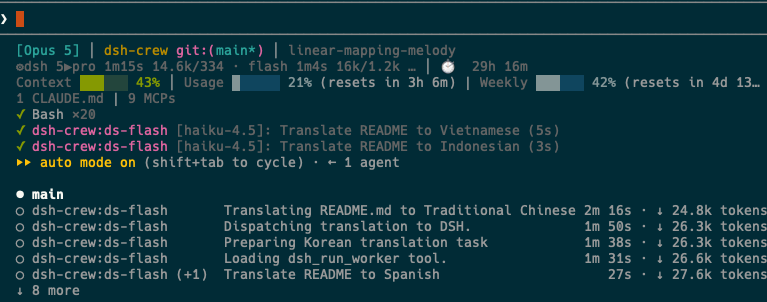
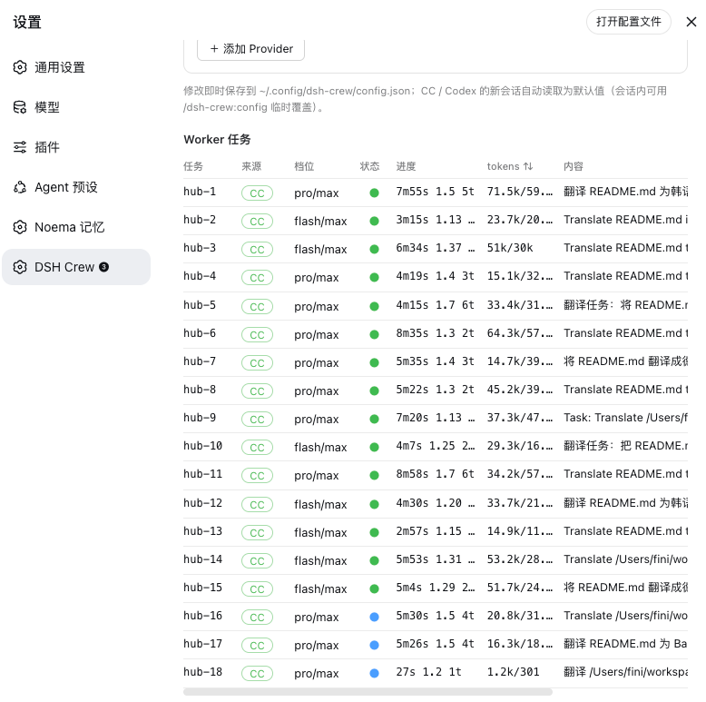

<p align="center">
  
</p>

<h1 align="center">DSH Crew</h1>

<p align="center">
  <strong><a href="https://github.com/deepseek-ai/deepseek-harness">DeepSeek Harness</a> 插件：在 Claude Code / Codex 里把活派给 DSH agent，同时保留宿主原生的子代理界面。</strong><br />
  <sub>原生进度 UI &bull; 档位策略与失败升档 &bull; DSH 会话进宿主 &bull; 视觉与生图 &bull; 一键安装</sub>
</p>

<p align="center">
  <sub>npm: <code>@zseven-w/dsh-crew</code> &middot; 当前插件版本: <code>0.1.0-rc.1</code> &middot; 已在 DSH <code>0.1.0-rc.6</code> 验证</sub>
</p>

<p align="center">
  <a href="./README.md">English</a> &middot; <a href="./README.zh.md"><b>简体中文</b></a> &middot; <a href="./README.zh-TW.md">繁體中文</a> &middot; <a href="./README.ja.md">日本語</a> &middot; <a href="./README.ko.md">한국어</a> &middot; <a href="./README.fr.md">Français</a> &middot; <a href="./README.es.md">Español</a> &middot; <a href="./README.de.md">Deutsch</a> &middot; <a href="./README.pt.md">Português</a> &middot; <a href="./README.ru.md">Русский</a> &middot; <a href="./README.hi.md">हिन्दी</a> &middot; <a href="./README.tr.md">Türkçe</a> &middot; <a href="./README.th.md">ไทย</a> &middot; <a href="./README.vi.md">Tiếng Việt</a> &middot; <a href="./README.id.md">Bahasa Indonesia</a>
</p>

<p align="center">
  <a href="https://github.com/ZSeven-W/dsh-crew/blob/main/LICENSE"></a>
</p>

<br />

<p align="center">
  
</p>
<p align="center"><sub>DSH Crew 设置页 —— 宿主集成、派发策略、执行方式与多模态桥</sub></p>

## 为什么用 DSH Crew

DSH Crew 是 [DeepSeek Harness](https://github.com/deepseek-ai/deepseek-harness)（DSH，开源 agent harness）的插件，它让 DSH agent 可以从 Claude Code 与 Codex 里被派活：orchestrator 的模型不变，活由真正的 DSH agent 去干——用的是这套 harness 的工具、沙箱、预设与会话历史——而在宿主里它仍然是一个带实时进度的原生子代理。

干活的是 DSH agent，不是一次裸的模型调用。档位（`flash` / `pro`）决定这个 agent 从 harness 已配置的模型阵容里拿到多强的能力（目前是 DeepSeek V4 Flash 与 V4 Pro）——DSH 那边换模型，这边不用改。

<table>
<tr>
<td width="50%">

### 🧵 原生进度 UI

worker 在 Claude Code / Codex 里就是普通子代理——派了几个、跑到第几步、调了多少工具、花了多少 token，都显示在宿主自己的任务面板里；claude-hud 还有一行状态栏段：`⚙dsh 1▶pro 2m14s 21.7k/606 ✓3`。

</td>
<td width="50%">

### 🎚️ 档位策略与失败升档

机械活走 `flash`，要推理走 `pro`，`effort` 从 `off` 到 `max`。`tier_policy` 可在工具层把所有派发收敛到某一档；`escalate_on_failure` 让失败的 flash 任务自动用 pro 重试一次——依据结果，而不是事前猜难度。

</td>
</tr>
<tr>
<td width="50%">

### 🏛️ DSH 会话跑在宿主里

把 bundle 装进 DSH profile 后，每个 worker 都是一等公民的 DSH 会话：出现在 Web UI 列表、按工作目录归组、按档位挂上你指定的 Agent 预设。DSH 没在跑时，派发自动回落到独立的 DSH runtime，CI 与无界面环境照样可用。

</td>
<td width="50%">

### 👁️ 视觉与生图

DSH 用的模型是纯文本的。`describe_image` 和 `generate_image` 借用你本机已登录的 CLI——Claude、Codex、Grok、Antigravity——或你自己配置的任意 OpenAI 兼容 API。会话里贴的图会留在原地正常显示，模型读到的是转写文本。

</td>
</tr>
<tr>
<td width="50%">

### 🔌 自定义 Provider

接自己的端点（Base URL + API Key + 模型），或写一条本地命令模板。每个 provider 都有连通测试：查可达性与鉴权，再真发一次视觉请求——现在就知道通不通，而不是任务跑到一半才发现。

</td>
<td width="50%">

### 📦 一键安装

设置页替你安装和更新 Claude Code 插件与 Codex 角色文件——marketplace 注册、权限白名单、HUD 接线、按本机渲染绝对路径——也同样一键还原。所有配置文件改动前都会先备份。

</td>
</tr>
</table>

## 工作方式

```
Claude Code / Codex（orchestrator，模型不变）
  └─ ds-flash / ds-pro  ← 原生子代理壳（进度出现在宿主任务 UI）
       └─ MCP: dsh_run_worker(tier, effort, cwd)
            ├─ hub 可达 → DSH 内的会话（Web UI 可见，按 cwd 归组）
            └─ 否则     → dsh-jsonrpc-agent 独立 runtime（worker.cordis.yml）
                 └─ DeepSeek V4 Flash / Pro（DSH SDK，事件流 → 进度与 token 统计）
```

## 一次派发，两个视角

派发是可以铺开的。下面这次，18 个 worker 并行翻译这份 README：宿主把它们算作自己的子代理，harness 则把它们当作真实会话来跑。

<p align="center">
  
</p>
<p align="center"><sub>Claude Code 里，dsh-crew worker 就是原生子代理；状态栏段实时显示在跑的档位、耗时与 token。</sub></p>

<p align="center">
  
</p>
<p align="center"><sub>DSH Crew 面板从 harness 一侧看同一次运行：每个任务由哪个宿主派出、档位与推理强度、实时进度与 token 消耗。</sub></p>

## 安装

从 npm 装进 DSH profile：

```bash
dsh plugin --profile web add @zseven-w/dsh-crew@latest
dsh web
```

或者从源码树本地开发：

```bash
dsh plugin --profile web add link:/path/to/dsh-crew
dsh web
```

`link:` 协议把 profile 依赖软链到本仓库，改完重新构建即时可见。

### 配置 DeepSeek 凭据（standalone 模式专用）

在 hub 模式下 — 即上面的安装方式 — worker 运行在 DSH 实例内部，使用 DSH 实例已配置的 DeepSeek 凭据。无需额外设置。

仅 standalone 回落方案需要自己的 key：从 Claude Code / Codex 派发任务而没有 DSH 实例运行时，会启动一个独立的 worker runtime 进程。从 [platform.deepseek.com](https://platform.deepseek.com) 取 API key，写入 `~/.config/dsh-crew/.env`：

```
DEEPSEEK_API_KEY=sk-...
```

### 自检

```bash
node scripts/smoke.mjs
```

smoke 测试会挑一条可用的路径派一个廉价任务——DSH 实例在跑就走 hub，否则走 standalone——并打印实际用的是哪条。十几秒内看到 `smoke test passed — configuration OK` 即配置成功。失败会打印具体原因，且只针对实际测的那条路径。

然后打开 设置 → DSH Crew，一键装好 Claude Code / Codex 集成。

## 背景与术语

- **DSH**（DeepSeek Harness）：DeepSeek 的开源 agent harness，Web UI 形态的编码代理，类似 Claude Code 但驱动 DeepSeek 模型。
- **MCP**（Model Context Protocol）：Anthropic 的 AI 工具接入协议，让 LLM 安全调用外部工具与数据源。
- **Cordis bundle**：DSH 的插件格式，本项目既可作独立 MCP 服务，也可装进 DSH Web 成为 hub 模式。
- **tier**：能力档位，决定 worker 从 DSH 已配置的模型阵容里拿到哪一档——`flash` 快而省（适合简单任务），`pro` 推理强（适合复杂问题）。当前对应 DeepSeek V4 Flash 与 V4 Pro；DSH 换模型，这边不用改。
- **worker**：被派去干活的 DSH agent —— 一个完整的会话，自带工具、沙箱与预设，不是一次裸的模型调用。
- **effort**：推理强度，`off` = 不用推理，`high` = 高投入推理，`max` = 最大推理投入。

## Agent 编排

在 **设置 → DSH Crew → Agent 编排** 里配置（保存在 `~/.config/dsh-crew/config.json`，CC / Codex 新会话自动读取为默认值）。

### 启用子 Agent

worker 派发的总开关。关闭后 `dsh_run_worker` / `dsh_spawn_worker` **在工具层直接拒绝派发**（错误码 `SUBAGENTS_DISABLED`）——这是 backend 硬执法，不是提示词约束。配置会被保留，重新开启即恢复。

### 档位状态

每个档位都有状态，对所有派发（blocking 与 async、hub 与 standalone 完全一致）在 backend 强制生效：

- **禁用（Disabled）**——派发到该档位被拒绝（`TIER_DISABLED`）。禁用一个档位绝不会偷偷启动另一个：指向禁用档位的 `default_tier` 会被跳过，两档都不可用时返回 `NO_AUTO_TIER` / `NO_WORKER_TIER`。
- **手动（Manual）**——档位可以被调用，但仅当用户（或 orchestrator 替用户）明确点名该档位、或明确选择对应的 `ds-flash` / `ds-pro` 子 Agent 时。它不会被自动选为默认，也不参与自动升档与自动复审。
- **自动（Auto）**——orchestrator 可以自动把任务委派给该档位。

**Manual 是路由约定，不是读心术。** MCP backend 无法可靠证明一次 `tier=pro` 调用是用户明确点名还是主模型自己的决定，因此 Manual 的准确语义是「backend 自动化全部排除 + 宿主路由指引中明确标注仅限用户点名」——仅此而已。

### 协作模式

| 模式 | Flash | Pro | 自动升档 | 自动 Pro 复审 |
|---|---|---|---|---|
| `flash-only` | Auto | 禁用 | 永不 | 永不 |
| `pro-only` | 禁用 | Auto | 不适用 | 永不 |
| `balanced`（默认） | Auto | Auto | 仅当开启 `escalate_on_failure` | 仅当开启 `pro_reviews_flash` |
| `review-pipeline` | Auto | Auto | 仅当开启 `escalate_on_failure` | 始终 |
| `custom` | 按 `flash_state` / `pro_state` | 按 `flash_state` / `pro_state` | 按 `escalate_on_failure` | 按 `pro_reviews_flash` |

当只有一个档位是 Auto 时，该档位承担所有常规可委派工作，与默认职责无关——只用 Flash 也能完成任何实现任务。

### 职责（roles）

`flash_roles` 与 `pro_roles` 是路由指引（谁擅长什么），不是关键词分类器。允许的 role：`implementation`、`simple_fix`、`tests`、`search_inspection`、`architecture`、`complex_debugging`、`refactor`、`code_review`。默认：Flash 负责实现 / 简单修复 / 测试 / 搜索；Pro 负责架构 / 复杂调试 / 重构 / 审查 / 实现。

### 主 Agent 模式

`direct-allowed` / `coordinator-first` / `dispatcher-only` 描述 orchestrator 偏好的工作方式。**这是宿主路由指引，不是安全边界**——Crew MCP backend 无法阻止 Claude Code 或 Codex 自己编辑文件、跑 shell 或使用宿主的其他工具。`dispatcher-only` 的意思是「尽量只做规划、派发、审查与整合」，而不是「宿主的工具被禁用了」。

主 Agent 通过 `dsh_worker_config`（无参调用返回 effective 状态与 `routing_guidance`）获知当前策略。已安装的 `/dsh-crew:config` / `/dsh-config` 是可发现的读取方式；建议的时机是：当你要做出路由敏感的委派决策、且当前策略未知或可能已变化时查一次——不是每一步都查。

### 策略优先级

从高到低：会话 `enabled` → 全局 `subagents_enabled` → 会话 `tier_policy` 硬钳制（`flash-only` / `pro-only`）→ 协作预设 → custom 档位状态 → 显式指定 tier → `default_tier` → 唯一的 Auto 档位 → 报错。`dsh_run_worker` 与 `dsh_spawn_worker` 共享同一套 resolver；hub jobs API 解析出同一个 effective tier 并把它真正传进 worker 的 spawn（Pro Only 下缺省 tier 启动的是 Pro，绝不会落到 registry 的 flash 默认值）。

旧的 `tier_policy` 完全保留：旧配置自动迁移（`flash-only` → Flash Only，`pro-only` → Pro Only，`auto` → Balanced），`/dsh-crew:config` / `/dsh-config` 继续接受 `policy=…` 作为会话钳制。

### Review Pipeline

在 `review-pipeline` 模式（blocking 派发）下，Flash 实现成功后自动追加 **一次** Pro 复审——最多一次，且仅在 Pro 为 Auto 时执行。复审任务收到原始任务、工作目录与 Flash 结果摘要，并被要求只审不改（除非用户要求修复）。实现结果绝不会被复审覆盖；复审失败时返回「实现成功 + 复审失败」，由 orchestrator 决定下一步。**异步派发（`dsh_spawn_worker`）保持原有的单任务行为**——需要复审请显式发起。「只读复审」是提示词约束；本项目没有只读沙箱（见限制说明）。

## Claude Code

### 安装

一键安装（二选一）：

- **DSH 设置页**（已装 hub 模式时）：设置 → DSH Crew → "安装到 Claude Code"
- **命令行**：`node src/install/cli.mjs all`

两者做同样的事：注册本地 marketplace（父目录 `dsh-plugins/` 为 marketplace 根） + `claude plugin install` + MCP 工具权限白名单 + claude-hud worker 状态段配置（改动前自动备份 settings.json，幂等）。**安装后重启会话生效**。

### 使用

- 直接在对话中说 "把 X 派给 ds-flash" 或 "把 X 派给 ds-pro"，子代理会执行任务
- 派发数量与实时进度显示在 Claude Code 的任务 UI
- **HUD 状态栏段**：`⚙dsh 1▶pro 2m14s 21.7k/606 ✓3`（当前档位 / 耗时 / token 占用 / 完成计数）
  - 本地开发用 `statusline/statusline.sh` 或 `statusline/worker-segment.sh` 可独立集成
- **超长任务**：CC 对 MCP 调用有超时限制（`MCP_TOOL_TIMEOUT` 可调），长任务可让 orchestrator 用 `dsh_spawn_worker` + `dsh_worker_result(wait_seconds)` 轮询
- **本地开发调试**：`claude --plugin-dir /path/to/dsh-crew` 临时加载


### 会话命令

只覆盖当前会话的全局默认值，且在工具层执法，不靠提示词自觉：

| 命令 | 作用 |
|---|---|
| `/dsh-crew:config` | 查看或设置本会话默认值：`tier=flash\|pro`、`effort=off\|high\|max`、`mode=auto\|hub\|standalone`、`timeout=<秒>`、`policy=auto\|flash-only\|pro-only`、`escalate=true\|false`、`reset` |
| `/dsh-crew:on` · `/dsh-crew:off` | 开关本会话的派发（关闭是硬开关，工具层直接拒绝） |
| `/dsh-crew:status` | worker 任务实时状态：档位、进度、tokens、当前工具 |

## Codex

### 安装

推荐用安装器（自动按本机路径渲染，并复制 `/dsh-config`、`/dsh-status` 命令）：

```bash
node src/install/cli.mjs codex
```

或手工复制（复制后需自行修改路径）：

```bash
cp codex/agents/*.toml ~/.codex/agents/    # 全局或项目级 .codex/agents/
```

角色文件内已预配：

- MCP server 挂载配置
- `default_tools_approval_mode = "approve"`（**必须**，否则 exec 模式下工具调用被自动取消）
- `tool_timeout_sec = 3600`

**注意**：手工复制时，role 文件中 `args` 的绝对路径需按实际安装位置修改；用安装器则无需手改。

### 使用

- 交互 TUI 里选 "spawn ds-pro to ..." 派发任务，Active/Done 面板显示进度
- `codex exec` 模式也可直接调 `dsh_run_worker`


### 会话命令

Codex 侧装的是同样两条 prompt：

| 命令 | 作用 |
|---|---|
| `/dsh-config` | 查看或设置本会话默认值：`tier=flash\|pro`、`effort=off\|high\|max`、`mode=auto\|hub\|standalone`、`timeout=<秒>`、`policy=auto\|flash-only\|pro-only`、`escalate=true\|false`、`reset` |
| `/dsh-status` | worker 任务实时状态：档位、进度、tokens、当前工具 |

## MCP 工具

| 工具 | 说明 |
|---|---|
| `dsh_run_worker` | 阻塞式派任务（`tier`: flash/pro，`effort`: off/high/max，`cwd`），等返回结果 |
| `dsh_spawn_worker` | 异步派发任务，返回 job id（用于并行 fan-out） |
| `dsh_worker_status` | 查询全部 job 的实时进度（turn/step/当前工具/token） |
| `dsh_worker_result` | 取结果，可指定 `wait_seconds` 等待 |
| `dsh_worker_cancel` | 取消指定 job，终止其 runtime 进程 |

进度同时镜像到 `~/.config/dsh-crew/status.d/`（每个写入方一个分片文件，statusline / 外部监控可读）。

## 多模态：视觉与生图

**DeepSeek 是纯文本模型**，不支持图片输入与生图输出。本插件通过 MCP 工具把这两项能力外借过来：

| 工具 | 说明 |
|---|---|
| `describe_image` | 看图回答问题（截图、设计稿、图表等），结果按 provider + 模型 + 图片 + 问题缓存 |
| `generate_image` | 按文字描述出图，保存到指定绝对路径；输出为平面位图（需要图层编辑用 OpenPencil） |

### 能力开关

**启用 Crew 视觉** 与 **启用生图**（设置 → DSH Crew → 多模态）是真实开关，控制工具注册：

- `vision_enabled = false` → Crew 的 `describe_image` 工具**不注册**，Crew 视觉 route（`deepseek-vision` adapter + 贴图转写）**不安装**。
- `imagegen_enabled = false` → Crew 的 `generate_image` 工具**不注册**。
- `provider = off` 即使开关开着也视为不可用。
- 关闭能力不会清空已保存的 provider/model——重新开启即恢复原设置。
- 由于工具注册发生在 DSH 启动时，**开关改动需要重启 DSH 生效**（UI 有明确提示）。

这样你就可以让 Crew 与自己的视觉插件（如 `dsh-vision`）共存：关掉 Crew 视觉 / 生图，只保留子 Agent 派发。

**会话贴图**：在 DSH 里把模型切到 `DeepSeek (视觉) ◉` 即可直接贴图。图片会留在会话里正常显示，插件在其后附上一段转写文字，并在发送前把图片剥离——你看图、模型读字。

### 配置

在 **DSH 设置页 → DSH Crew → 多模态**（或直接编辑 `~/.config/dsh-crew/config.json`）配置：

**视觉 provider**（看图）：

- `claude-code`（默认，用 haiku，便宜）
- `codex`（用 GPT，可指定具体模型）
- `grok`（用 Grok）
- `agy`（Antigravity）
- `自定义`（OpenAI 兼容 API 或本地命令）
- `off`（禁用）

**生图 provider**（出图）：

- `codex`（`$imagegen`，gpt-image-2）
- `agy`（Nano Banana）
- `grok`（Imagine）
- `自定义`（OpenAI 兼容 API 或本地命令）
- `off`（禁用）

### 自定义 Provider

两种接入方式：

**API**：任何 OpenAI 兼容端点
- 填 Base URL、API Key、模型列表
- 视觉走 `/chat/completions` 图片 base64 内联
- 生图走 `/images/generations`
- **必须填"生图模型"才具备生图能力**，否则该 provider 只出现在视觉选择里

**CLI**：本地命令模板，占位符经安全引用后代入
- 视觉：`{image} {question} {model}` → stdout 作为答案
- 生图：`{prompt} {output} {size}` → 命令须写出文件到 `{output}`
- 两条命令至少填一条；填了哪条就具备哪项能力

**连通测试**：每个自定义 provider 都有测试按钮
- API：检查端点可达性、鉴权，真发一次视觉请求验证
- CLI：检查可执行文件，真跑一次命令验证
- 生图：仅校验配置，不实际出图

**借用的订阅 CLI**（claude / codex / grok / agy）需要你本机已登录，插件不会替你绕过它们的权限。

## Hub 模式

本包同时是合法的 DSH bundle（`dsh.bundle` + `cordis.patch.yml`）。执行 `dsh plugin add dsh-crew` 装进 DSH Web profile 后：

- **Worker 会话一等公民化**：以 first-class session 运行在 DSH host 里（`agents.create` + per-session model/effort waterfall + 默认 preset），出现在 Web UI 会话列表，随时可点开围观完整执行过程
- **按工作目录归类**：Web UI 中按 cwd 管理 worker 会话
- **Loopback API**：
  - `POST/GET /_dsh/dsh-crew/jobs`：spawn 任务、列表、长轮询结果、cancel
  - `GET /_dsh/dsh-crew/ping`：健康探测（MCP shim 靠它判断 hub 是否在跑）
  - `POST /_dsh/dsh-crew/install`：一键安装 Claude Code / Codex 集成（即 `src/install/` 的后端）
- **自动探测**：CC/Codex 的 MCP shim 自动探测 hub（`DSH_CREW_HUB` 环境变量，默认 `http://127.0.0.1:3080`）
  - DSH Web 在跑 → job 进 hub 模式（`mode: "hub"`）
  - 没跑 → 回落 standalone runtime

## 方案选择与限制

### 日常订阅用户 → 壳 subagent 方案（推荐）

- **现状**：Claude Code 壳子代理用 haiku 中转，每次派发多花几百~几千 token
- **权衡**：用少量 Anthropic token 换取原生任务 UI、进度实时显示、无需额外配置
- **建议**：如果你已订阅 Claude Pro 或用 Claude Code，用这套——省事且透明

### 按量付费 / CI 环境 → Router 直连方案

- **现状**：Claude Code 子代理的 frontmatter 不支持直连第三方模型；本仓库 scratchpad 里的 router 实验方案需要 API-key 凭据的 Claude Code，但订阅 OAuth 会被 Anthropic 上游 403
- **建议**：
  - 如果用 API-key 凭据（非 OAuth）且想省 Anthropic token，可在本地跑 router 直连 DeepSeek
  - CI 环境通常也是 API-key，该方案更经济（全部用 DeepSeek token）
  - 需要自行测试 router 集成（非官方支持）

### 跑着 DSH Web → Hub 模式自动启用

- **现状**：若 `dsh plugin add dsh-crew` 装进 DSH Web profile，job 以一等公民会话跑在 host 里，出现在 Web UI 会话列表
- **建议**：本地开发迭代时推荐启用 hub 模式，worker 进度可在 Web UI 完整围观；跨机器协作或无 Web UI 环境用 Claude Code / Codex 壳方案

### 已知事项

- Codex 角色理论上可试 `model_provider` 直指 DeepSeek（未验证）；本桥不依赖它
- 生图输出为平面位图，需要分层编辑用 OpenPencil
- **运行时依赖**：仅 `@modelcontextprotocol/sdk` 与 `zod`；`@deepseek-ai/*` 为 peerDependencies（由 DSH 宿主提供）
- **Codex 必须配置**：`default_tools_approval_mode = "approve"`，否则工具调用被自动取消
- **主 Agent 模式不是宿主工具沙箱**：Crew backend 无法限制宿主自己的编辑 / shell 工具，它只是路由指引
- **Manual 档位无法可靠区分「用户点名」与「主模型自行选择」**：backend 强制的是「不参与自动选择 / 升档 / 复审」，宿主指引写明「仅用户明确点名时使用」
- **自动 Pro 复审的只读要求是提示词约束**——本项目没有只读沙箱
- **异步派发不会自动串联复审**；review-pipeline 语义作用于 blocking 的 `dsh_run_worker`
- **没有文件级写锁**：并行派发的 worker 可能改到同一文件，防重叠写入要靠任务拆分（后续工作）

## Fork 说明

本仓库是 [ZSeven-W/dsh-crew](https://github.com/ZSeven-W/dsh-crew) 的个人定制 fork：在原 MIT 许可的工作之上新增可配置 Crew 编排（子 Agent 开关、档位状态、协作模式、主 Agent 模式、职责、Review Pipeline）与多模态真实开关。原始的安装、Hub 与 standalone 派发链路保持不变。

## 开发

```bash
pnpm install
node_modules/.bin/tsdown src/client/index.tsx --format cjs --platform browser \
  --target es2022 --tsconfig tsconfig.client.json --out-dir .client-build --clean
node scripts/build-client.mjs   # 把 bundle 包装成 DSH 模块加载器格式
node scripts/smoke.mjs          # 真实派发一个 flash 任务做端到端自检
```

运行时依赖只有 `@modelcontextprotocol/sdk` 与 `zod`；所有 `@deepseek-ai/*` 都是 peerDependencies，由 DSH 宿主提供——这样插件才留在宿主的单一模块 realm 里。

## 生态

- [DSH Noema](https://github.com/ZSeven-W/dsh-noema) —— DSH 的长期记忆
- [DSH OpenPencil](https://github.com/ZSeven-W/dsh-openpencil) —— 在对话里预览与编辑 `.op` 设计文档

## 许可

MIT
